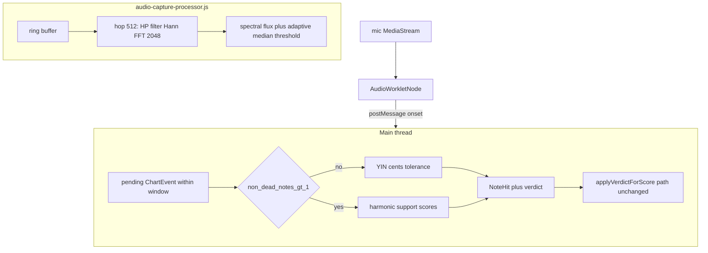

# Note recognition — implementation README

How Mesician scores mic input against Guitar Pro charts using **NOTE_RECOGNITION_V2** (verify-first, onset-driven, mobile-friendly DSP).

Related docs:

- [`NOTE_RECOGNITION.md`](NOTE_RECOGNITION.md) — broader MIR survey (mono vs poly, chroma, libraries).
- [`NOTE_RECOGNITION_V2.md`](NOTE_RECOGNITION_V2.md) — design rationale and constraints.

## Approach

1. **Verify, don’t transcribe.** The chart (`chart.json`) already specifies expected MIDI notes and times. We never ask “what chord is this?” only whether onset evidence matches those expectations inside timing windows: symmetric **±35 / ±80 / ±150 ms** for **early** hits and for **late** hits up through `slight`; the outer **late** “off” boundary gains extra ms from chart note length (`[t0,t1]`, see [`classifyTimingDirected`](src/lib/scoring/engine.ts)).
2. **Onsets drive scoring.** Continuous `requestAnimationFrame` polling was replaced by spectral-flux peaks from an `AudioWorklet`. Hits register on attacks; sustained ringing doesn’t spam verdicts.
3. **Mono vs poly follows the chart.**  
   - One non-dead sounding note → band-restricted **YIN** on the snippet aligned with the FFT window.  
   - Two or more → **matched harmonic energy** on an FFT magnitude vector (max-held ~120 ms for strums).

## Data flow



## File map

| Path | Role |
| --- | --- |
| [`public/worklets/audio-capture-processor.js`](public/worklets/audio-capture-processor.js) | AudioWorklet: HP filter, Hann-window FFT (2048), spectral flux, median threshold (~1 s history), 50 ms refractory, RMS gate; max-holds last ~12 spectra per onset; transfers `spectrum` + `waveSnippet`. |
| [`src/lib/audio/audio-capture-worklet.ts`](src/lib/audio/audio-capture-worklet.ts) | Loads `/worklets/audio-capture-processor.js` via `audioWorklet.addModule`, wraps `AudioWorkletNode` (`numberOfOutputs: 0`), exposes `setOnsetHandler` / `connect` / `disconnect`. |
| [`src/lib/scoring/spectrum.ts`](src/lib/scoring/spectrum.ts) | Bin-band sums (`±0.5` semitone), guitar-band normalization (~65 Hz–5 kHz), coarse peak MIDI (`inferMidiFromSpectrum`). |
| [`src/lib/scoring/yin.ts`](src/lib/scoring/yin.ts) | Band-restricted YIN CMNDF search ±2 semitones around expected \(f_0\). |
| [`src/lib/scoring/recognize.ts`](src/lib/scoring/recognize.ts) | `scoreOnsetAgainstEvent` / `scoreBpOnsetAgainstEvent`, mono/poly branches, harmonic weights `[1.0, 0.6, 0.4, 0.25]`, optional **`stringProfile`** adjustments (BP expected MIDI bias, mono cents slack, scaled poly harmonic threshold), `inferPlayedStringFret` (capo-aware via `effectiveOpenStringMidi`). |
| [`src/lib/scoring/pitch.ts`](src/lib/scoring/pitch.ts) | Tuning helpers; `hzToMidi`; **`effectiveOpenStringMidi`** adds capo for UI inference (chart MIDIs already use AlphaTab `realValue`). |
| [`src/lib/scoring/engine.ts`](src/lib/scoring/engine.ts) | Verdict math (`VERDICT_WINDOWS_MS`, `classifyTiming`, `classifyTimingDirected` + `lateGraceMsFromDuration`, `applyVerdictToScore`, types). |
| [`src/components/practice/PracticeClient.tsx`](src/components/practice/PracticeClient.tsx) | Pairs onsets to nearest pending event; applies hits; passes `OnsetRecognizerTuning` with **`stringProfile`** from storage or post-gate snapshot; maps AudioContext time → song time while playing. |
| [`src/components/practice/PracticeShell.tsx`](src/components/practice/PracticeShell.tsx) | Loads chart; **gates practice** behind open-string calibration when `meta.tuning` has six strings; passes calibrated profile snapshot into `PracticeClient`. |
| [`src/components/practice/StringCalibrationFlow.tsx`](src/components/practice/StringCalibrationFlow.tsx) | Scrolls synthetic open-string arpegio ([`buildOpenStringCalibrationChart`](src/lib/calibration/build-calibration-chart.ts)); mic + Basic Pitch + [`verifyCalibrationPitch`](src/lib/calibration/verify-calibration-pitch.ts); merges [`StringProfile`](src/lib/calibration/string-profile.ts) to `localStorage`. |
| [`src/components/practice/PracticeControls.tsx`](src/components/practice/PracticeControls.tsx) | Shows optional wrong-note hint line next to last hit. |

## Worklet ↔ main message contract

Each onset posts:

```ts
{
  type: "onset";
  audioContextTime: number; // seconds (≈ currentFrame / sampleRate)
  currentFrame: number;
  sampleRate: number;
  rms: number;
  spectrum: Float32Array;   // length FFT_N/2+1 (1025), linear magnitude
  waveSnippet: Float32Array; // length FFT_N (2048), HP-filtered raw window
}
```

Buffers are **transferables** (`postMessage(..., [spectrum.buffer, waveSnippet.buffer])`). No `SharedArrayBuffer`; works without COOP/COEP headers.

Optional runtime tweak from main thread (future hook):

```js
node.port.postMessage({ type: "config", rmsGate: 0.016, medianThresholdFactor: 2.5 });
```

## Timing and latency

Song time at onset while transport is playing:

\[
\text{songSec} = \text{playSongStart} + (\text{audioContextTime} - \text{playAudioStart}) \times \text{playbackRate}
\]

Same clock domain as [`getSongTime`](src/lib/audio/transport.ts). User-adjustable **`latencyMs`** from [`src/lib/calibration/storage.ts`](src/lib/calibration/storage.ts) shifts timing error inside `scoreOnsetAgainstEvent` (`timingErrorMs = songMs + latencyMs − eventCenterMs`).

The separate interval-driven **miss timer** (still in `PracticeClient`) fires when adjusted song time passes each note window without a verdict — unchanged from before.

### String calibration (before practice)

Tracks with **`meta.tuning` length six** enter [`StringCalibrationFlow`](src/components/practice/StringCalibrationFlow.tsx) once per visit (after [`PracticeShell`](src/components/practice/PracticeShell.tsx) loads the chart). The UI scrolls a **synthetic six-note open-string arpeggio** (capo-aware sounding MIDIs via [`chartNoteMidi`](src/lib/chart/note-midi.ts)). Transport volume is zero (visual cues only); the player plucks each string as notes cross the highway playhead.

- Successfully detected notes merge samples into [`StringProfile`](src/lib/calibration/string-profile.ts), persisted under `mesician_string_profile_v1` in [`storage.ts`](src/lib/calibration/storage.ts); key = tuning + capo fret.
- **Skip for now** still opens practice; scoring falls back until a profile matches the chart meta.
- **Practice and perform modes** share the same mic path — `PracticeClient` always passes `stringProfile` through `scoreBpOnsetAgainstEvent` / harmonic fallback whenever a matching profile exists (not gated on mode).
- **Debug uploads** (`DEBUG_REPORT_VERSION` **3**) include optional **`meta.stringProfile`** for offline replay parity (viewer shows a compact table).

## Tuneable knobs (defaults)

| Knob | Default | Where |
| --- | --- | --- |
| FFT size | 2048 | Worklet |
| Hop | 512 samples | Worklet |
| Flux median window | ~96 hops (~1 s @ 48 kHz) | Worklet |
| Median multiplier | `2.35` | Worklet (`medianThresholdFactor` configurable) |
| Refractory | ~50 ms | Worklet |
| RMS gate | `0.014` | Worklet (+ `MIC_RMS_GATE_HINT` in `PracticeClient` for wrong-note flash) |
| Strum max-hold | ~12 hops (~128 ms @ 48 kHz / hop 512) | Worklet |
| YIN semitone radius | ±2 | `yinAroundExpected` |
| YIN CMNDF reject | `> 0.2` (`YIN_CMNDF_MAX`) | `recognize.ts` |
| Mono cents tolerance | ±50 (`MONO_CENTS_TOLERANCE`) | `recognize.ts` |
| Poly support threshold | `0.18` (`POLY_SUPPORT_THRESHOLD`) | `recognize.ts` |
| Wrong-note flash TTL | `200 ms` | `PracticeClient` |

## Wrong-note hint

Ghost-hit overlays on the highway were removed. Instead, when an onset fires inside the pairing window but **no** string registers `pitchOk` with a non-miss verdict—while RMS ≥ gate—we flash a short amber hint showing approximate MIDI plus optional **capo-aware** string/fret inference (`inferPlayedStringFret`). This does **not** change verdict state; misses still come from timing expiry.

## Mobile / Safari notes

- **AudioWorklet** runs off the UI thread — preferred over `AnalyserNode` sampling gaps.
- Mic constraints (`echoCancellation/noiseSuppression/autoGainControl: false`) remain in `PracticeClient` — match practice scenarios over aggressive browser DSP.
- `AudioContext` still requires user gesture resume (`acquireMic`, play button paths).
- Bluetooth headsets often expose **8 kHz** mono via SCO — detection note lives in `NOTE_RECOGNITION_V2.md` §11 (pitch scoring degrades sharply).

## Out of scope (see V2 Stage 4)

- Global adaptive flux / RMS auto-tuning (string profile adjusts pitch paths only today)  
- Guided latency calibration UI beyond stored `latencyMs`  
- Cents visualization on the highway  
- ML transcription (Basic Pitch offline-only; live path stays verify-first, not CREPE-grade AMT)  
- `SharedArrayBuffer` ring buffers  

## Troubleshooting

| Symptom | Things to try |
| --- | --- |
| Nothing ever hits | Mic permission / insecure context; check browser console for worklet load failure (`addModule` 404 → verify `/public/worklets/...`). Increase RMS gate slightly if extreme noise floors. |
| Only misses | Negative `latencyMs` skew early — adjust calibration slider; confirm transport playing when picking matching windows. |
| Chords partly scored | Lower `POLY_SUPPORT_THRESHOLD` slightly or verify loudness; max-hold window covers staggered strums but very slow sweeps may split across windows. |
| Wrong-note flashes spam | Raise `MIC_RMS_GATE_HINT` / worklet RMS gate; tighten flux multiplier to reduce false onsets. |

## Acceptance checklist (manual)

- Single-note passage registers timing + pitch.
- Multi-note chord registers per-string when strings sound together within ~120 ms.
- Wrong fret triggers amber hint then eventual miss if timing window expires without a hit.
- Chart with **capo** still aligns MIDIs (AlphaTab `realValue`) — inference hint adds capo to open-string MIDI.
